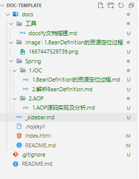
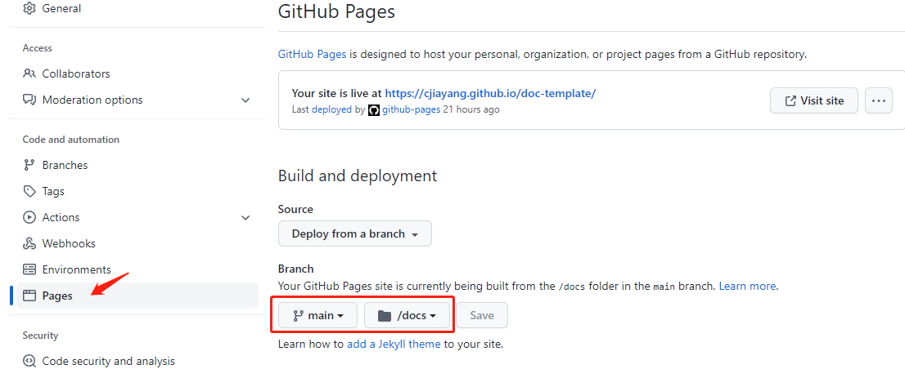

本文主要介绍docsify文档系统的配置。顺便介绍了市场上主流的团队文档工具。读完本文，可以按文中步骤搭建一个可用的docsify文档系统。

## 写作环境

- vscode
- vscode插件：Office Viewer(Markdown Editor)
- nodejs
- docsify-cli

前提要安装好nodejs，然后用npm安装docsify-cli。

## 文档工具对比

文档工具市场上有很多产品可供选择，针对各种不同的用户群体和不同用途都可以找到合适的。可以从以下几点进行考虑和选择：

- 用户群体：是个人使用还是团队使用，团队规模大小
- 协作性：是否利于团队协作
- 易用性：是否容易搭建，容易发布，容易上手
- 适配性：是否支持多端阅读与发布
- 数据：数据是私有化部署，还是托管给三方管理
- 部署：部署配置是否麻烦，产品成熟度如何，社区是否完善

介绍几款用过的文档工具：

**商业版：**

- 语雀：无法独立部署，团队协作需要付费
- 蚂蚁笔记：leanote

**开源版：**

- docsify：简洁，无需编译，配置简单，部署简单，但功能较少。结合版本管理系统方便团队合作。
- vuepress：适合个人博客文档。结合版本管理系统，方便团队协作。
- hexo：适合个人博客文档。结合版本管理系统，方便团队协作。
- showdoc：是个非常适合IT团队的在线API文档、技术文档工具，可独立部署，有商业版。
- MinDoc：MinDoc 是一款针对IT团队开发的简单好用的文档管理系统，可独立部署。
- Halo：一个java博客系统，开源可独立部署

## docsify简介

docsify非常简洁轻量，唯一要求就是文档要用markdown来编写。只要配置好index.html及相关文件就可以部署了，部署完就可以很方便的将目录变成可以访问的网页了，特别适合对项目添加文档说明。下面重点讲docsify的配置。

## docsify配置

docsify的配置都在index.html文件里。功能的增强主要是通过插件来实现的，所以本文会介绍用到的相关插件。

先列下本文要实现的功能。

- 要能实现搜索
- 要实现侧边栏，方便文档导航
- 侧边栏要能实现展开和收缩。
- 代码块能实现语法高亮
- 代码块要能实现复制功能
- 要能实现内容分页
- 使用VUE主题风格

### 初始化

以我的示例项目为例。我的项目目录是doc-template，文档放在doc-template/docs文件夹里。那么按以下操作：

进入doc-template文件夹，打开终端，输入命令：

```powershell
docsify init ./docs
```

在docs目录下就会生成以下文件：

- index.html
- README.md
- .nojekyll

运行以下命令即可预览。

```powershell
docsify serve ./docs
```

### 功能配置

初始化后的文件空空如也，我们要实现预期功能就得加些配置。配置相关的插件，并配置相关的选项后，运行后预览功能。

index.html配置如下：

```html
<!DOCTYPE html>
<html lang="en">
<head>
  <meta charset="UTF-8">
  <title>Document</title>
  <meta http-equiv="X-UA-Compatible" content="IE=edge,chrome=1" />
  <meta name="description" content="Description">
  <meta name="viewport" content="width=device-width, initial-scale=1.0, minimum-scale=1.0">
  <!-- vue主题 -->
  <link rel="stylesheet" href="https://cdn.jsdelivr.net/npm/docsify@4/lib/themes/vue.css">
  <!-- 侧边栏折叠 -->
  <link rel="stylesheet" href="https://cdn.jsdelivr.net/npm/docsify-sidebar-collapse/dist/sidebar.min.css" />
</head>
<body>
  <div id="app">加载中...</div>
  <script>
    window.$docsify = {
      // 文档标题
      name: 'doc-template',
      // 搜索
      search: {
        placeholder: "搜索",
        paths: "auto"
      },
      // 加载侧边栏文件
      loadSidebar: true,
      alias: {
        '.* /_sidebar.md': '/_sidebar.md',
        '/.*/.*/_sidebar.md': '/_sidebar.md'
      },
      subMaxLevel: 3,
      // 自动添加文档标题
      autoHeader: true,
      // 内容分页
      pagination: {
        previousText: "上一篇",
        nextText: "下一篇",
        // 跨篇章展示
        crossChapter: true
      },
      auto2top: true,
      // 侧边栏展示层级
      sidebarDisplayLevel: 1
    }
  </script>
  <!-- Docsify v4 -->
  <script src="https://cdn.jsdelivr.net/npm/docsify@4"></script>

  <!-- plugins -->
  <!-- 搜索插件 -->
  <script src="https://cdn.jsdelivr.net/npm/docsify/lib/plugins/search.min.js"></script>
  <!-- 图片放大插件 -->
  <script src="https://cdn.jsdelivr.net/npm/docsify/lib/plugins/zoom-image.min.js"></script>
  <!-- 代码复制插件 -->
  <script src="https://cdn.jsdelivr.net/npm/docsify-copy-code/dist/docsify-copy-code.min.js"></script>
  <!-- 分页插件 -->
  <script src="https://cdn.jsdelivr.net/npm/docsify-pagination/dist/docsify-pagination.min.js"></script>
  <!-- 侧边栏折叠插件 -->
  <script src="https://cdn.jsdelivr.net/npm/docsify-sidebar-collapse/dist/docsify-sidebar-collapse.min.js"></script>
  <!-- 代码高亮 -->
  <script src="https://cdn.jsdelivr.net/npm/prismjs@1/components/prism-bash.min.js"></script>
  <script src="https://cdn.jsdelivr.net/npm/prismjs@1/components/prism-java.min.js"></script>
</body>
</html>

```

侧边栏配置就是markdown里的无序列表。将文档目录规划好，对应的侧边栏即可配置出来。

我的文档目录如下：



对应侧边栏_sidebar.md配置如下：

```powershell
- Spring 系列

  - IoC 容器

    - [BeanDefinition 的资源定位过程](Spring\1.IOC\1.BeanDefinition的资源定位过程.md)
    - [解析BeanDefinition](Spring\1.IOC\2.解析BeanDefinition.md)
  - AOP

    - [AOP 源码实现及分析](Spring\2.AOP\1.AOP源码实现及分析.md)
- 工具

  - 文档工具
    - [docsify文档搭建](工具\docsify文档搭建.md)
```

### 部署到github

github创建一个项目仓库，将docs目录下文件上传。然后github仓库设置里配置github page，将page的根目录配置成docs目录即可完成部署。



本文预览：http://cjiayang.github.io/doc-template

### 其他

- 文档：[docsify文档](https://docsify.js.org/#/zh-cn/)
- 插件：[docsify插件](https://docsify.js.org/#/zh-cn/plugins)

留个问题：

文档的图片都只能放在文档顶层目录的image文件中，能不能放到各个文档所在的image文件中呢。暂时还没找到方案。

当然上传图床是一种选择，用typora加图床可以实现。
